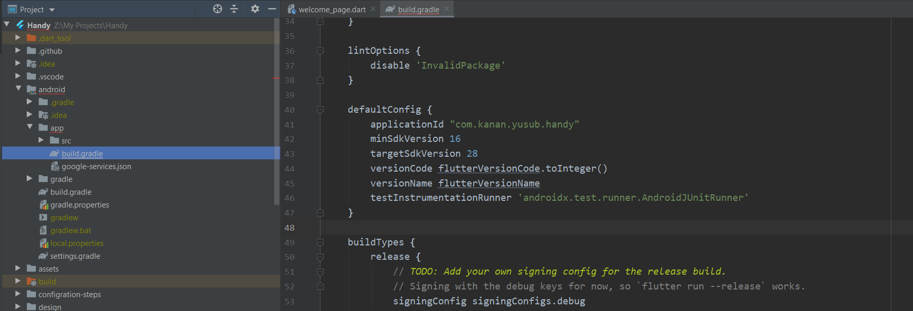
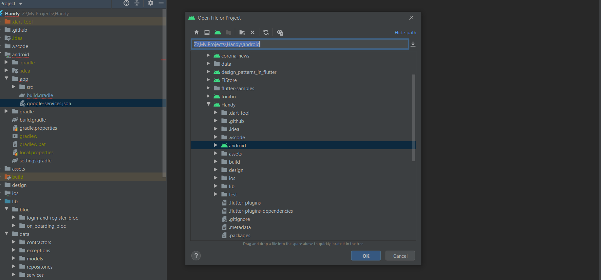
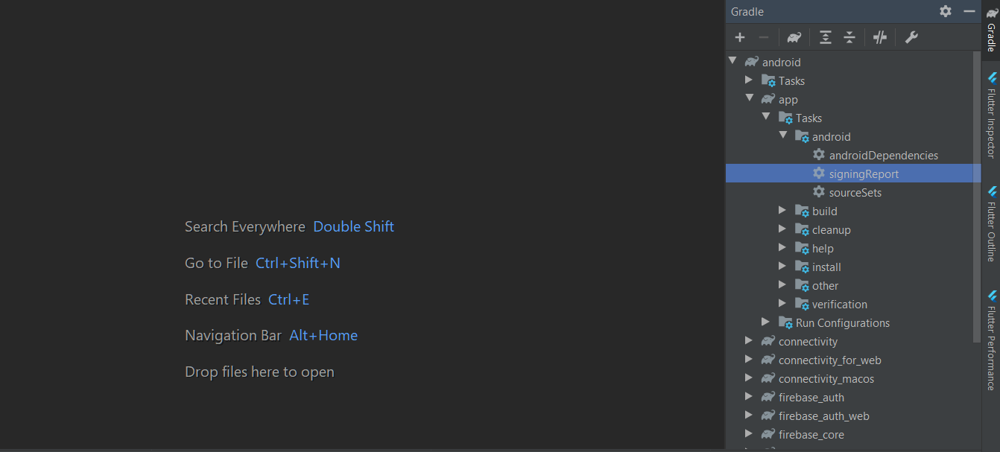
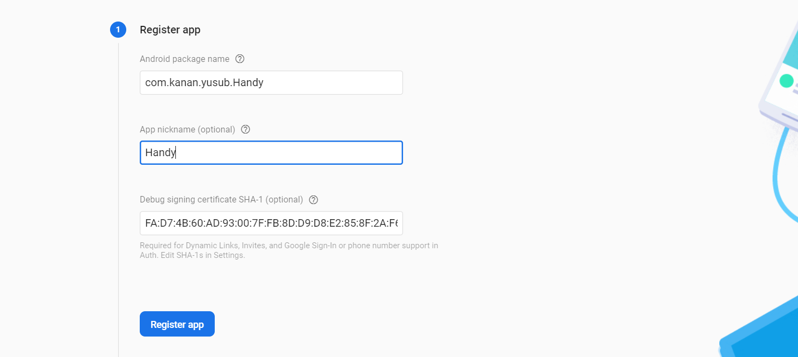
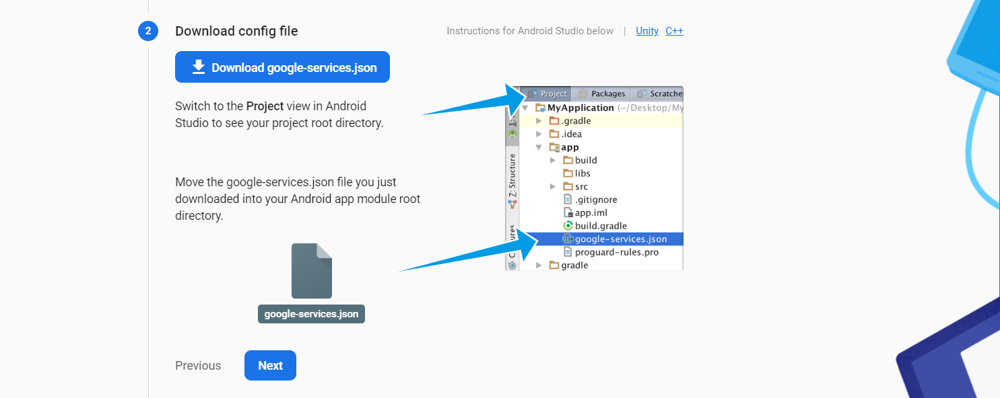
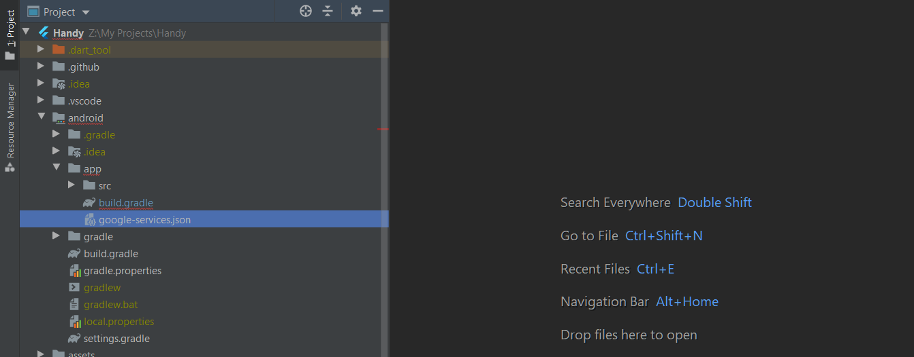
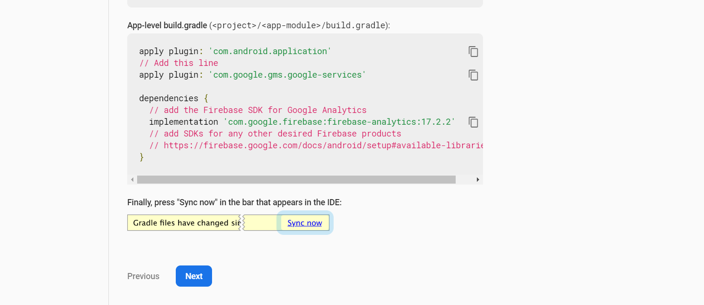
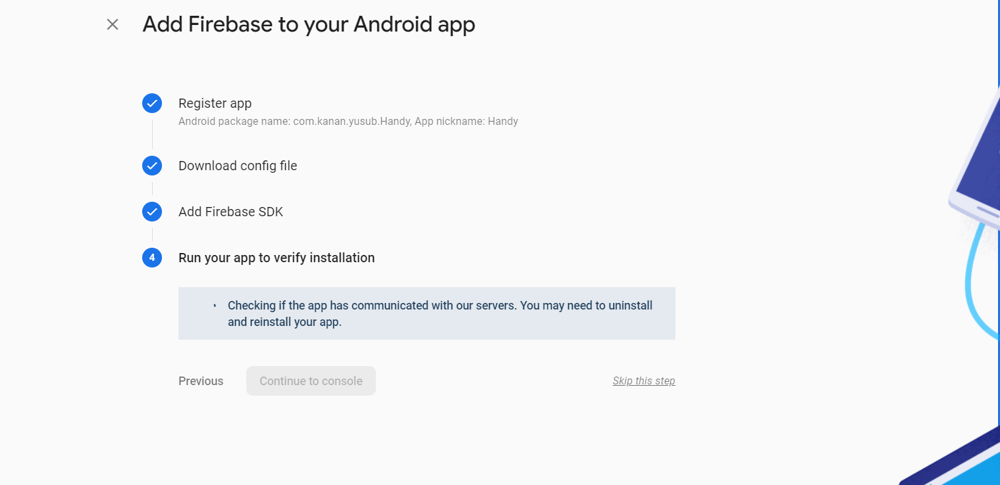

# Handy

-------

## Configuration for yourself

This project contains `google-services.json` file of my own. You can connect your own firebase project using the following configrations:

> Please, keep patient and follow the configrations correctly!

**Step 1:** Clone the repository to your device.

**Step 2:** Open `android/app/build.gradle` and change `applicationId` as you want: 

**Step 3:** Create firebase project and add new android project to firebase.

**Step 4:** Write the `same applicationId` to the `android package name` field:

**Step 5:** Open the `android` directory of `Handy` using Android Studio:

**Step 6:** Tap to `Gradle` from the right side and select `android/app/Tasks/android/signingReport` and wait a bit to get `SHA1` key:

**Step 7:** Copy `SHA1` from terminal:

**Step 8:** Paste to `Debug signing certificate SHA-1` field in `Firebase` and click to `Register` button:

**Step 9:** Download `google-services.json` and click to next button:

**Step 10:** Replace file of `Handy` that is stored in `android/app/` called `google-services.json` with your own `google-services.json` file that you downloaded in the previous step:

**Step 11:** Click `Next` and `Skip` button in the next steps:

**Step 12:** Go to `Authentication` screen and enable `Email/Password` and `Google` authentication:

[App Design](http://bit.ly/handyappdesign)

## Maintainers
[Kanan Yusubov](https://github.com/yusubx)

Stuff to do before running the flutter app: 
Add code below to the bottom of build.gradle file
task createWrapper(type: Wrapper) {
    gradleVersion = '4.9'
};
Then run command:
cd android && gradlew signinReport

